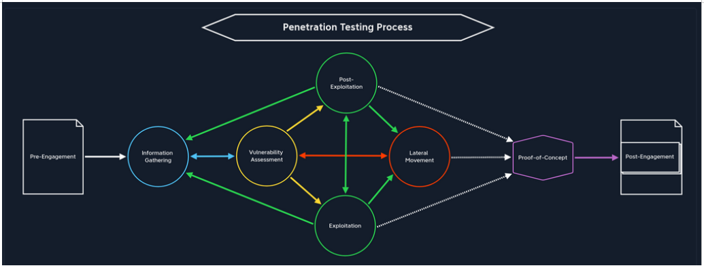

# Penetration Testing Process

<br>

- [Penetration Testing Process](#penetration-testing-process)<br>

   - [Pre-Engagement](#pre-engagement)
   - [Information Gathering](#information-gathering)
   - [Vulnerability Assessment](#vulnerability-assessment) 	
   - [Exploitation ](#exploitation) 	
   - [Post-Exploitation](#post-exploitation) 	
   - [Lateral Movement](#lateral-movement) 	
   - [Proof-of-Concept](#proof-of-concept) 	
   - [Post-Engagement](#post-engagement) 	

- [Testing Methods](#testing-methods) <br>

     - [External Penetration Test](#external-penetration-test)
     - [Internal Penetration Test](#internal-penetration-test)<br>

- [Types of Penetration Testing](#types-of-penetration-testing)<br>

     - [Blackbox](#blackbox)
     - [Greybox](#greybox)
     - [Whitebox](#whitebox)
     - [Red-Teaming](#red-teaming)
     - [Purple-Teaming](#purple-teaming)

- [Setting Up a Pentest Distro](#setting-up-a-pentest-distro)

<br>

___

<br>



A penetration testing process is defined by successive steps and events performed by the penetration tester to find a path to the predefined objective.

<br>
<br>

## Pre-Engagement
<br>
The first step is to create all the necessary documents in the pre-engagement phase, discuss the assessment objectives, and clarify any questions.

<br>
<br>
<br>
<br>

## Information Gathering
<br>
Once the pre-engagement activities are complete, we investigate the company's existing website we have been assigned to assess. We identify the technologies in use and learn how the web application functions.

<br>
<br>

**We can obtain the necessary information relevant to us in many different ways:**
  
- `Open-Source Intelligence (OSINT)`
- `Infrastructure Enumeration (name servers, mail servers, web servers, cloud instances, and more)`
- `Service Enumeration`
- `Host Enumeration`
- `Pillaging (understanding the role of the system)`

<br>
<br>
<br>

## Vulnerability Assessment 	
<br>
With this information, we can look for known vulnerabilities and investigate questionable features that may allow for unintended actions.

<br>
<br>

**We found an open TCP port 2121 on a host during the information-gathering phase:**

- a `TCP port 2121`. - TCP already means that this service is `connection-oriented`.
- `Is this a standard port?` - No, because these are between `0-1023`, aka well-known or system ports.
- Are there any numbers in this port number that look familiar? - Yes, `TCP port 21 (FTP)`. From our experience, we will get to know many `standard ports` and their services, which administrators often try to disguise, but often use "easy to remember" alternatives.
- Based on our guess, we can try to connect to the service using `Netcat` or an `FTP client` and try to establish a connection to confirm or disprove our guess.

<br>

```diff
@@ Nessus, Qualys, OpenVAS @@
```
<br>

**Find vulnerability disclosures and CVEs**
<br>

- [CVEdetails](https://www.cvedetails.com/)
- [Packet Storm Security](https://packetstormsecurity.com/)
- [Exploit DB](https://www.exploit-db.com/)
- [NIST](https://nvd.nist.gov/vuln/search?execution=e2s1)    
- [SecurityFocus](https://bugtraq.securityfocus.com/archive)
- [Vulners](https://vulners.com/) 

<br>
<br>
<br>

## Exploitation 
<br>
Once we have found potential vulnerabilities, we prepare our exploit code, tools, and environment and test the webserver for these potential vulnerabilities.
<br>
<br>

`Complexity represents the effort of exploiting a specific vulnerability.`

We need to assess the probability of successfully executing a particular attack against the target. [CVSS Scoring](https://nvd.nist.gov/vuln-metrics/cvss) can help us here, using the [NVD calculator](https://nvd.nist.gov/vuln-metrics/cvss/v3-calculator) better to calculate the specific attacks and their probability of success.

<br>
<br>
<br>

## Post-Exploitation
<br>
Once we have successfully exploited the target, we jump into information gathering and examine the webserver from the inside. If we find sensitive information during this stage, we try to escalate our privileges (depending on the system and configurations). From the inside (local) perspective, we have many more possibilities and alternatives to access certain information that is relevant to us. We want to get the privileges of the root (on Linux-based systems) or the domain administrator/local administrator/SYSTEM (on Windows-based systems).
<br>
<br>

`Persistence is maintaining access to the exploited host.`

Security systems such as Data Loss Prevention (DLP) and Endpoint Detection and Response (EDR) help detect and prevent data exfiltration. In addition to Network Monitoring, many companies use encryption on hard drives to prevent external parties from viewing such information.

+ What is the name of the security regulation for credit card payments a company must adhere to? `PCI-DSS`

<br>
<br>
<br>

## Lateral Movement 	
<br>
If other servers and hosts in the internal network are in scope, we then try to move through the network and access other hosts and servers using the information we have gathered. The goal here is that we test what an attacker could do within the entire network.
<br>
<br>
One of the most common examples is ransomware. If a system in the corporate network is infected with ransomware, it can spread across the entire network. Some pivoting techniques (access inaccessible systems via an intermediary system) allow us to use the exploited host as a proxy and perform all the scans from our attack machine or VM. In this way, we make non-routable networks can still be reached. 
<br>
<br>

Another standard method is to use our existing credentials on other systems. We can use the tool `Responder` to intercept NTLMv2 hashes.  If we can intercept a hash from an administrator, then we can use the pass-the-hash technique to log in as that administrator (in most cases) on multiple hosts and servers. After all, the Lateral Movement stage aims to move through the internal network.

`There are many ways to protect against lateral movement, including network (micro) segmentation, threat monitoring, IPS/IDS, EDR, etc.`

<br>
<br>
<br>

## Proof-of-Concept
<br>
Finally, we are ready to show off our hard work and help our client, and those responsible for remediation efficiently reproduce our results. We create a proof-of-concept that proves that these vulnerabilities exist and potentially even automate the individual steps that trigger these vulnerabilities.
<br>
<br>

`The more practical version of a PoC is a script or code that automatically exploits the vulnerabilities found.`
<br>

Therefore, working against our script instead of with it and modifying and securing the systems so that our script no longer works does not mean that the information obtained from the script cannot be obtained in another way. Show how fixing one flaw will break the chain, but the other flaws will still exist. For example, if a user uses the password Password123, the underlying vulnerability is not the password but the password policy.
<br>
<br>
`High quality stands for high standards, which we should emphasize through our remediation recommendations.`

<br>
<br>
<br>

## Post-Engagement
<br>
Finally, the documentation is completed and presented to our client as a formal report deliverable. Afterward, we may hold a report walkthrough meeting to clarify anything about our testing or results and provide any needed support to personnel tasked with remediating our findings. Once testing is complete, we should perform any necessary cleanup, such as deleting tools/scripts uploaded to target systems, reverting any (minor) configuration changes we may have made, etc.
<br>
<br>

`We should not keep any Personal Identifiable Information (PII), potentially incriminating info, or other sensitive data we came across throughout testing.`
<br>

We should not be implementing changes ourselves or even giving precise remediation advice (i.e., for SQL Injection, we may say "sanitize user input" but not give the client a rewritten piece of code). We should ensure that any systems used to connect to the client's systems or process data have been wiped or destroyed and that any artifacts leftover from the engagement are stored securely (encrypted) per our firm's policy and per contractual obligations to our client.

What designation do we typically give a report when it is first delivered to a client for a chance to review and comment? `DRAFT`

<br>
<br>
<br>

## Testing Methods
<br>

### External Penetration Test

Many pentests are performed from an external perspective or as an anonymous user on the Internet. Most customers want to ensure that they are as protected as possible against attacks on their `external network perimeter`. We can perform testing from our own host (hopefully using a VPN connection to avoid our ISP blocking us) or from a VPS.

Some clients will not care about `stealth`, while others will request that we proceed as quietly as possible and approach the target systems to avoid being banned by the firewalls and IDS/IPS systems and avoid triggering an alarm. They may ask for a stealthy or "hybrid" approach where we gradually become "noisier" to test their detection capabilities. Ultimately our goal here is to access external-facing hosts, obtain sensitive data, or gain access to the internal network.
<br>
<br>

### Internal Penetration Test

In contrast to an external pentest, an internal pentest is when we perform testing from `within the corporate network`. This stage may be executed after successfully penetrating the corporate network via the external pentest or starting from an assumed breach scenario. Internal pentests may also access isolated systems with `no internet access` whatsoever, which usually requires our `physical presence` at the client's facility.

<br>
<br>
<br>

## Types of Penetration Testing
<br>

### Blackbox 
- `Minimal`. Only the essential information, such as IP addresses anddomains, is provided. The penetration tester must perform `in-depth reconnaissance` to learn about the target. This type of penetration test most simulates an `actual attack` but is not as comprehensive as other assessment types and could leave misconfigurations/vulnerabilities undiscovered.

### Greybox 
- `Extended`. The tester is given `a certain amount` of information in advance. This may be a list of in-scope IP addresses/ranges, low-level credentials to a web application or Active Directory, or some application/network diagrams. This type of penetration test can simulate a malicious insider or see what an attacker can do with a low level of access. In this scenario, the tester will typically spend less time on reconnaissance and more time looking for misconfigurations and attempting exploitation.

### Whitebox 
- `Maximum`. Here `everything` is disclosed to us. This gives us an internal view of the entire structure, which allows us to prepare an attack using internal information. We may be given detailed configurations, admin credentials, web application source code, etc. This assessment type is highly comprehensive as the tester will have access to both sides of a target and perform a comprehensive analysis.

### Red-Teaming 
- May include `physical testing and social engineering`, among other things. Can be combined with any of the above types.

### Purple-Teaming 
- It can be combined with any of the above types. However, it focuses on working closely `with the defenders`.

<br>
<br>
<br>

## Setting Up a Pentest Distro
<br>

VMs on a hypervisor run isolated from the primary operating system, which offers a layer of isolation and protection between our production network and vulnerable networks, such as Hack The Box, or when connecting to client environments from a VM (though VM breakout vulnerabilities do arise from time to time).

<br>

## Folder Structure

<br>


<br>

Here we have a folder for the client Acme Company with two assessments, **Internal Penetration Test (IPT)** and **External Penetration Test (EPT)**. Under each folder, we have subfolders for saving scan data, any relevant tools, logging output, scoping information (i.e., lists of IPs/networks to feed to our scanning tools), and an evidence folder that may contain any credentials retrieved during the assessment, any relevant data retrieved as well as screenshots.

<br>
<br>
<br>
<br>

The field of information technology changes rapidly. New attacks are discovered frequently, and we need to stay on top of the latest and greatest **TTPs**  (Tactics, Techniques, and Procedures) to be as effective as possible and provide our clients with the necessary information to help secure their environments from an ever-evolving threat landscape.

**Infosec** → Protecting the "confidentiality, integrity, and availability of data," or the `CIA triad`.
