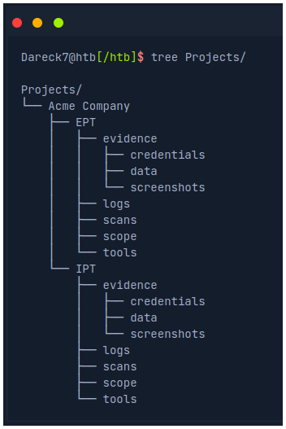

# Setting Up a Pentest Distro

 

- [Folder Structure](#folder-structure)

 

VMs on a hypervisor run isolated from the primary operating system, which offers a layer of isolation and protection between our production network and vulnerable networks, such as Hack The Box, or when connecting to client environments from a VM (though VM breakout vulnerabilities do arise from time to time).

 

## Folder Structure

 

 

Here we have a folder for the client Acme Company with two assessments, **Internal Penetration Test (IPT)** and **External Penetration Test (EPT)**. Under each folder, we have subfolders for saving scan data, any relevant tools, logging output, scoping information (i.e., lists of IPs/networks to feed to our scanning tools), and an evidence folder that may contain any credentials retrieved during the assessment, any relevant data retrieved as well as screenshots.
