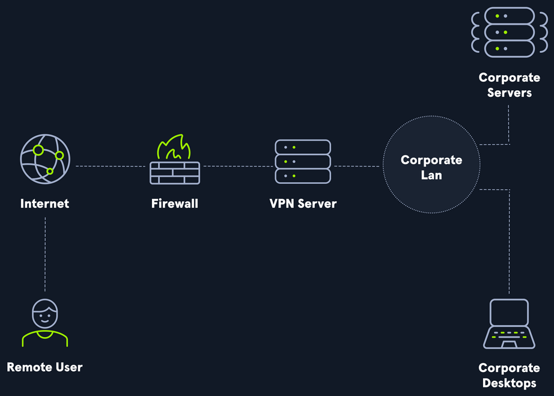

# Why Use A VPN?

 

We can use a VPN service and connect to a VPN server in another part of our country or another region of the world to obscure our browsing traffic or disguise our public IP address. This can provide us with some level of security and privacy. Using a VPN service comes with the risk that the provider is not doing what they are saying and are logging all data. 

Usage of a VPN service **does not** guarantee anonymity or privacy but is useful for bypassing certain network/firewall restrictions or when connected to a possible hostile network (i.e., a public airport wireless network). A VPN service should never be used with the thought that it will protect us from the consequences of performing nefarious activities.

 

 

### SSL VPN
- `uses the web browser as the VPN client. The connection is established between the browser and an SSL VPN gateway can be configured to only allow access to web-based applications such as email and intranet sites, or even the internal network but without the need for the end user to install or use any specialized software.` 

### Client-based VPN 
- `requires the use of client software to establish the VPN connection. Once connected, the user's host will work mostly as if it were connected directly to the company network and will be able to access any resources (applications, hosts, subnets, etc.) allowed by the server configuration. Some corporate VPNs will provide employees with full access to the internal corporate network, while others will place users on a specific segment reserved for remote workers.`
